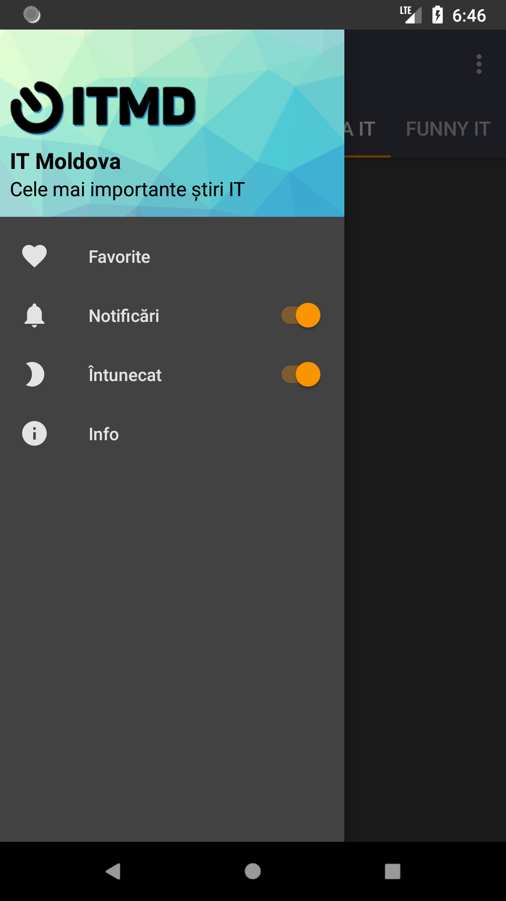
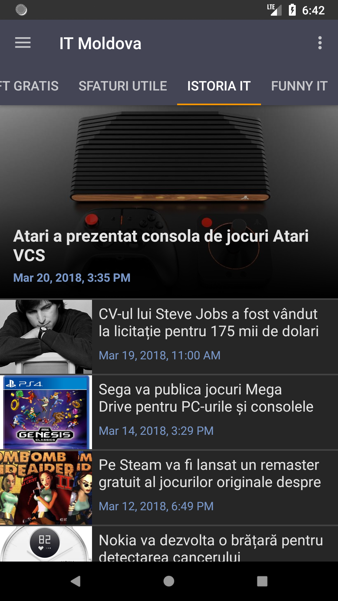

# IT Moldova #

#### _IT Moldova_ is simple app that shows articles from ITMoldova.com web site. ####

## Features ##
 - View articles
 - Bookmark articles
 - Receive notifications
 - Choose between Light or Dark theme

## Built with ##
 - Kotlin
 - Room
 - Dagger
 - RxJava
 - Retrofit

        
        
        </img>

License
-------

    Copyright 2015 - 2016 Veaceslav Grec

    Licensed under the Apache License, Version 2.0 (the "License");
    you may not use this file except in compliance with the License.
    You may obtain a copy of the License at

        http://www.apache.org/licenses/LICENSE-2.0

    Unless required by applicable law or agreed to in writing, software
    distributed under the License is distributed on an "AS IS" BASIS,
    WITHOUT WARRANTIES OR CONDITIONS OF ANY KIND, either express or implied.
    See the License for the specific language governing permissions and
    limitations under the License.

